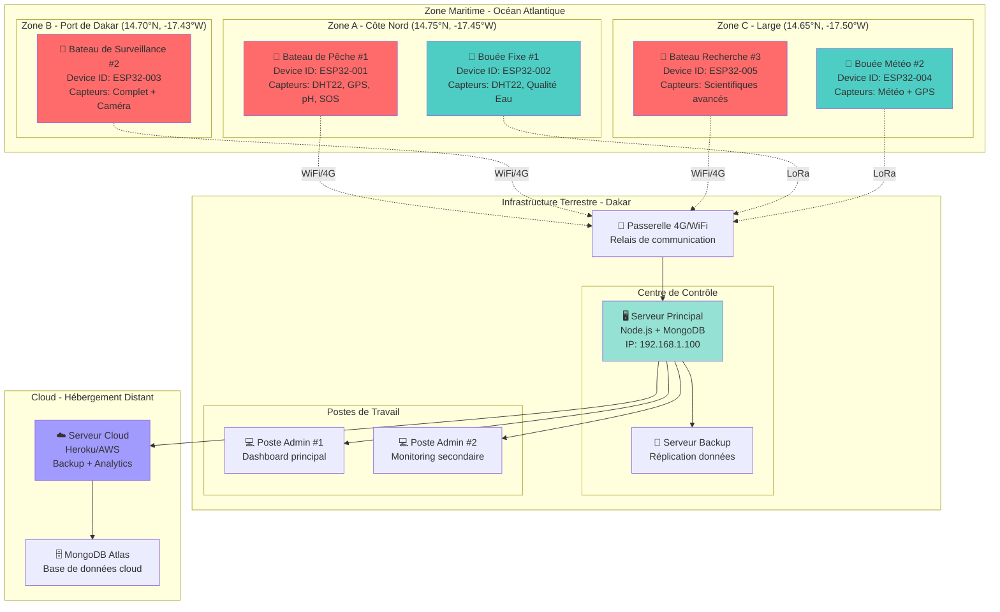
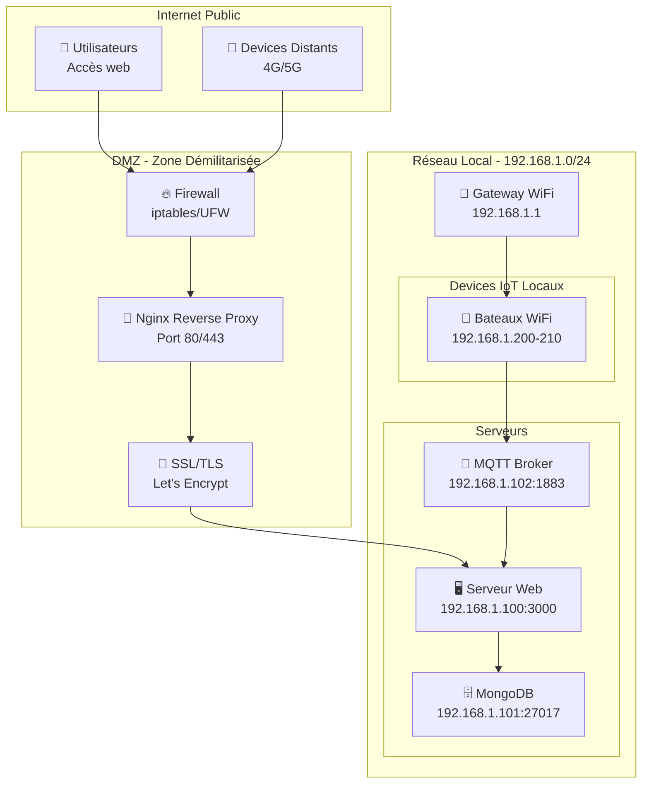

# 🗺️ Guide de Déploiement - Proj_iot

Ce document détaille le déploiement physique et logiciel du système IoT, de l'installation des devices à la mise en production de la plateforme.

---

## 📍 Carte de Déploiement Physique

### Scénario: Surveillance de la Zone Maritime de Dakar



---

## 🔌 Configuration des Devices IoT

### Device #1: Bateau de Pêche (ESP32-001)

#### Matériel Installé
- **Microcontrôleur**: ESP32 DevKit v1
- **Alimentation**: Batterie 12V + Panneau solaire 20W
- **Boîtier**: IP67 étanche
- **Antenne**: WiFi externe + GPS active

#### Capteurs Connectés

| Capteur | Pin | Fonction | Fréquence |
|---------|-----|----------|-----------|
| DHT22 | GPIO 4 | Température/Humidité | 30s |
| GPS NEO-6M | UART (16/17) | Position | 10s |
| pH Sensor | ADC 34 | Qualité eau | 60s |
| Turbidité | ADC 35 | Clarté eau | 60s |
| Bouton SOS | GPIO 5 | Alerte | Événement |
| LED Status | GPIO 2 | Indicateur | Continu |

#### Configuration Réseau
```cpp
// Configuration WiFi
const char* ssid = "MarineNetwork_Dakar";
const char* password = "SecurePass2025";
const char* deviceId = "ESP32-001";
const char* serverUrl = "http://192.168.1.100:3000/api/sensor-data";

// Configuration MQTT (alternative)
const char* mqttBroker = "mqtt.proj-iot.com";
const int mqttPort = 1883;
```

#### Emplacement Physique
- **Latitude**: 14.7500°N
- **Longitude**: -17.4500°W
- **Zone**: Côte Nord de Dakar
- **Installation**: Mât du bateau, hauteur 2m au-dessus du pont

---

### Device #2: Bouée Fixe (ESP32-002)

#### Matériel Installé
- **Microcontrôleur**: ESP32 + Module LoRa SX1276
- **Alimentation**: Batterie marine 24V + Panneau solaire 50W
- **Boîtier**: IP68 submersible
- **Ancrage**: Bouée flottante avec ancre 50kg

#### Capteurs Connectés

| Capteur | Pin | Fonction | Fréquence |
|---------|-----|----------|-----------|
| DHT22 | GPIO 4 | Température/Humidité | 60s |
| DS18B20 | GPIO 15 | Température eau | 30s |
| pH Sensor | ADC 34 | Acidité | 120s |
| Turbidité | ADC 35 | Clarté | 120s |
| Niveau eau | ADC 36 | Marée | 300s |

#### Configuration LoRa
```cpp
// Configuration LoRa pour longue portée
#define LORA_FREQUENCY 868E6  // Europe
#define LORA_BANDWIDTH 125E3
#define LORA_SPREADING_FACTOR 12
#define LORA_TX_POWER 20

const char* deviceId = "ESP32-002";
```

#### Emplacement Physique
- **Latitude**: 14.7520°N
- **Longitude**: -17.4480°W
- **Zone**: 2km de la côte
- **Profondeur**: Capteurs à -2m sous surface

---

## 🌐 Infrastructure Serveur

### Serveur Principal (Centre de Contrôle)

#### Spécifications Matérielles
- **Processeur**: Intel Core i5 ou équivalent
- **RAM**: 8GB minimum
- **Stockage**: 256GB SSD
- **Réseau**: Ethernet Gigabit + WiFi
- **OS**: Ubuntu Server 22.04 LTS

#### Installation du Serveur

```bash
# 1. Mise à jour du système
sudo apt update && sudo apt upgrade -y

# 2. Installation Node.js
curl -fsSL https://deb.nodesource.com/setup_18.x | sudo -E bash -
sudo apt install -y nodejs

# 3. Installation MongoDB
wget -qO - https://www.mongodb.org/static/pgp/server-6.0.asc | sudo apt-key add -
echo "deb [ arch=amd64,arm64 ] https://repo.mongodb.org/apt/ubuntu jammy/mongodb-org/6.0 multiverse" | sudo tee /etc/apt/sources.list.d/mongodb-org-6.0.list
sudo apt update
sudo apt install -y mongodb-org

# 4. Démarrage MongoDB
sudo systemctl start mongod
sudo systemctl enable mongod

# 5. Installation PM2 (Process Manager)
sudo npm install -g pm2

# 6. Clone du projet
cd /opt
sudo git clone https://github.com/DONZO-sigui/Projet-IOT.git
cd Projet-IOT

# 7. Installation dépendances
npm install

# 8. Configuration environnement
sudo nano .env
```

#### Fichier .env Production

```bash
# Serveur
NODE_ENV=production
PORT=3000
HOST=0.0.0.0

# Session
SESSION_SECRET=VotreCleSuperSecrete2025!

# MongoDB
MONGODB_URI=mongodb://localhost:27017/proj_iot_db
MONGODB_USER=admin
MONGODB_PASSWORD=SecurePassword123

# API Keys
OPENWEATHER_API_KEY=votre_cle_api
MAPBOX_TOKEN=votre_token_mapbox

# MQTT
MQTT_BROKER_URL=mqtt://localhost:1883
MQTT_USERNAME=iot_user
MQTT_PASSWORD=MqttSecure2025

# Email (pour alertes)
SMTP_HOST=smtp.gmail.com
SMTP_PORT=587
SMTP_USER=alerts@proj-iot.com
SMTP_PASSWORD=VotreMotDePasse

# Sécurité
ADMIN_USERNAME=admin
ADMIN_PASSWORD_HASH=$2b$10$...  # Hash bcrypt
```

#### Démarrage avec PM2

```bash
# Démarrer l'application
pm2 start server.js --name "proj-iot"

# Sauvegarder la configuration
pm2 save

# Démarrage automatique au boot
pm2 startup

# Monitoring
pm2 monit
```

---

## 🔒 Configuration Réseau et Sécurité

### Architecture Réseau



### Configuration Firewall (UFW)

```bash
# Activer le firewall
sudo ufw enable

# Autoriser SSH (administration)
sudo ufw allow 22/tcp

# Autoriser HTTP/HTTPS (web)
sudo ufw allow 80/tcp
sudo ufw allow 443/tcp

# Autoriser MQTT (devices IoT)
sudo ufw allow 1883/tcp

# Bloquer accès direct MongoDB (sécurité)
sudo ufw deny 27017/tcp

# Autoriser réseau local uniquement pour MongoDB
sudo ufw allow from 192.168.1.0/24 to any port 27017

# Vérifier les règles
sudo ufw status verbose
```

### Configuration Nginx (Reverse Proxy)

```nginx
# /etc/nginx/sites-available/proj-iot

server {
    listen 80;
    server_name proj-iot.com www.proj-iot.com;
    
    # Redirection HTTPS
    return 301 https://$server_name$request_uri;
}

server {
    listen 443 ssl http2;
    server_name proj-iot.com www.proj-iot.com;
    
    # Certificats SSL
    ssl_certificate /etc/letsencrypt/live/proj-iot.com/fullchain.pem;
    ssl_certificate_key /etc/letsencrypt/live/proj-iot.com/privkey.pem;
    
    # Sécurité SSL
    ssl_protocols TLSv1.2 TLSv1.3;
    ssl_ciphers HIGH:!aNULL:!MD5;
    
    # Proxy vers Node.js
    location / {
        proxy_pass http://localhost:3000;
        proxy_http_version 1.1;
        proxy_set_header Upgrade $http_upgrade;
        proxy_set_header Connection 'upgrade';
        proxy_set_header Host $host;
        proxy_set_header X-Real-IP $remote_addr;
        proxy_set_header X-Forwarded-For $proxy_add_x_forwarded_for;
        proxy_cache_bypass $http_upgrade;
    }
    
    # Fichiers statiques (cache)
    location /public {
        alias /opt/Projet-IOT/public;
        expires 30d;
        add_header Cache-Control "public, immutable";
    }
}
```

---

## 📊 Monitoring et Maintenance

### Surveillance du Système

```bash
# Vérifier l'état de l'application
pm2 status

# Logs en temps réel
pm2 logs proj-iot

# Statistiques de performance
pm2 monit

# Redémarrer si nécessaire
pm2 restart proj-iot

# Vérifier MongoDB
sudo systemctl status mongod

# Espace disque
df -h

# Utilisation mémoire
free -h

# Processus actifs
htop
```

### Scripts de Maintenance

```bash
#!/bin/bash
# /opt/scripts/backup-daily.sh

# Backup MongoDB
DATE=$(date +%Y%m%d_%H%M%S)
BACKUP_DIR="/backup/mongodb"

mongodump --out $BACKUP_DIR/dump_$DATE

# Compression
tar -czf $BACKUP_DIR/dump_$DATE.tar.gz $BACKUP_DIR/dump_$DATE
rm -rf $BACKUP_DIR/dump_$DATE

# Suppression backups > 7 jours
find $BACKUP_DIR -name "*.tar.gz" -mtime +7 -delete

echo "Backup completed: dump_$DATE.tar.gz"
```

### Cron Jobs

```bash
# Éditer crontab
crontab -e

# Backup quotidien à 2h du matin
0 2 * * * /opt/scripts/backup-daily.sh

# Redémarrage hebdomadaire (dimanche 3h)
0 3 * * 0 pm2 restart proj-iot

# Nettoyage logs (tous les jours)
0 4 * * * pm2 flush
```

---

## 🚀 Déploiement Cloud (Optionnel)

### Heroku Deployment

```bash
# 1. Installation Heroku CLI
curl https://cli-assets.heroku.com/install.sh | sh

# 2. Login
heroku login

# 3. Créer application
heroku create proj-iot-production

# 4. Ajouter MongoDB Atlas
heroku addons:create mongolab:sandbox

# 5. Variables d'environnement
heroku config:set NODE_ENV=production
heroku config:set SESSION_SECRET=VotreCleSuperSecrete

# 6. Déploiement
git push heroku main

# 7. Ouvrir l'application
heroku open
```

### AWS EC2 Deployment

```bash
# 1. Créer instance EC2 (Ubuntu 22.04)
# 2. Configurer Security Groups (ports 22, 80, 443, 1883)
# 3. Connexion SSH
ssh -i "votre-cle.pem" ubuntu@ec2-xx-xx-xx-xx.compute.amazonaws.com

# 4. Installation (même procédure que serveur local)
# 5. Configuration domaine (Route 53)
# 6. SSL avec Let's Encrypt
sudo certbot --nginx -d proj-iot.com -d www.proj-iot.com
```

---

## 📱 Configuration des Devices - Code Complet

### ESP32 - Code Principal

```cpp
// ESP32-001 - Bateau de Pêche
#include <WiFi.h>
#include <HTTPClient.h>
#include <DHT.h>
#include <TinyGPS++.h>
#include <HardwareSerial.h>

// Configuration WiFi
const char* ssid = "MarineNetwork_Dakar";
const char* password = "SecurePass2025";
const char* serverUrl = "http://192.168.1.100:3000/api/sensor-data";
const char* deviceId = "ESP32-001";

// Configuration Capteurs
#define DHTPIN 4
#define DHTTYPE DHT22
#define PH_PIN 34
#define TURBIDITY_PIN 35
#define SOS_BUTTON 5
#define LED_STATUS 2

DHT dht(DHTPIN, DHTTYPE);
TinyGPSPlus gps;
HardwareSerial GPS_Serial(1);

// Variables globales
float temperature = 0;
float humidity = 0;
float latitude = 0;
float longitude = 0;
float phValue = 0;
float turbidity = 0;
bool sosActive = false;

void setup() {
  Serial.begin(115200);
  
  // Initialisation pins
  pinMode(SOS_BUTTON, INPUT_PULLUP);
  pinMode(LED_STATUS, OUTPUT);
  
  // Initialisation capteurs
  dht.begin();
  GPS_Serial.begin(9600, SERIAL_8N1, 16, 17);
  
  // Connexion WiFi
  connectWiFi();
  
  Serial.println("Device ESP32-001 initialisé!");
}

void loop() {
  // Lecture capteurs
  readSensors();
  
  // Vérification bouton SOS
  checkSOS();
  
  // Envoi données toutes les 30 secondes
  static unsigned long lastSend = 0;
  if (millis() - lastSend > 30000) {
    sendDataToServer();
    lastSend = millis();
  }
  
  // Clignotement LED (device actif)
  blinkLED();
  
  delay(100);
}

void connectWiFi() {
  Serial.print("Connexion WiFi...");
  WiFi.begin(ssid, password);
  
  int attempts = 0;
  while (WiFi.status() != WL_CONNECTED && attempts < 20) {
    delay(500);
    Serial.print(".");
    attempts++;
  }
  
  if (WiFi.status() == WL_CONNECTED) {
    Serial.println("\nWiFi connecté!");
    Serial.print("IP: ");
    Serial.println(WiFi.localIP());
  } else {
    Serial.println("\nÉchec connexion WiFi!");
  }
}

void readSensors() {
  // DHT22
  temperature = dht.readTemperature();
  humidity = dht.readHumidity();
  
  // GPS
  while (GPS_Serial.available() > 0) {
    if (gps.encode(GPS_Serial.read())) {
      if (gps.location.isValid()) {
        latitude = gps.location.lat();
        longitude = gps.location.lng();
      }
    }
  }
  
  // pH (calibration nécessaire)
  int phRaw = analogRead(PH_PIN);
  phValue = map(phRaw, 0, 4095, 0, 1400) / 100.0;
  
  // Turbidité (calibration nécessaire)
  int turbRaw = analogRead(TURBIDITY_PIN);
  turbidity = map(turbRaw, 0, 4095, 0, 100);
}

void checkSOS() {
  if (digitalRead(SOS_BUTTON) == LOW) {
    sosActive = true;
    digitalWrite(LED_STATUS, HIGH);
    sendSOSAlert();
    delay(1000); // Debounce
  } else {
    sosActive = false;
  }
}

void sendDataToServer() {
  if (WiFi.status() != WL_CONNECTED) {
    connectWiFi();
    return;
  }
  
  HTTPClient http;
  http.begin(serverUrl);
  http.addHeader("Content-Type", "application/json");
  
  // Construction JSON
  String jsonData = "{";
  jsonData += "\"deviceId\":\"" + String(deviceId) + "\",";
  jsonData += "\"temperature\":" + String(temperature, 2) + ",";
  jsonData += "\"humidity\":" + String(humidity, 2) + ",";
  jsonData += "\"latitude\":" + String(latitude, 6) + ",";
  jsonData += "\"longitude\":" + String(longitude, 6) + ",";
  jsonData += "\"ph\":" + String(phValue, 2) + ",";
  jsonData += "\"turbidity\":" + String(turbidity, 2) + ",";
  jsonData += "\"sos\":" + String(sosActive ? "true" : "false");
  jsonData += "}";
  
  int httpCode = http.POST(jsonData);
  
  if (httpCode > 0) {
    Serial.println("Données envoyées: " + jsonData);
    Serial.println("Code réponse: " + String(httpCode));
  } else {
    Serial.println("Erreur envoi: " + http.errorToString(httpCode));
  }
  
  http.end();
}

void sendSOSAlert() {
  Serial.println("🆘 ALERTE SOS ACTIVÉE!");
  // Envoi immédiat au serveur
  sendDataToServer();
}

void blinkLED() {
  static unsigned long lastBlink = 0;
  if (millis() - lastBlink > 1000) {
    digitalWrite(LED_STATUS, !digitalRead(LED_STATUS));
    lastBlink = millis();
  }
}
```

---

## 📋 Checklist de Déploiement

### Phase 1: Préparation Hardware
- [ ] Achat et réception de tous les composants
- [ ] Tests individuels de chaque capteur
- [ ] Assemblage des devices dans boîtiers étanches
- [ ] Tests d'étanchéité (IP67/IP68)
- [ ] Installation panneaux solaires et batteries

### Phase 2: Configuration Software
- [ ] Programmation ESP32 avec code final
- [ ] Tests de connexion WiFi/LoRa
- [ ] Calibration des capteurs (pH, turbidité)
- [ ] Tests d'envoi de données au serveur
- [ ] Validation GPS et précision

### Phase 3: Installation Serveur
- [ ] Configuration serveur Ubuntu
- [ ] Installation Node.js, MongoDB, MQTT
- [ ] Déploiement application web
- [ ] Configuration firewall et sécurité
- [ ] Tests de performance et charge

### Phase 4: Déploiement Terrain
- [ ] Installation bouées fixes (ancrage)
- [ ] Installation devices sur bateaux
- [ ] Tests de portée réseau
- [ ] Validation transmission données
- [ ] Formation utilisateurs

### Phase 5: Monitoring et Maintenance
- [ ] Configuration alertes automatiques
- [ ] Mise en place backups quotidiens
- [ ] Documentation procédures maintenance
- [ ] Plan de remplacement batteries
- [ ] Calendrier inspections mensuelles

---

## 🆘 Dépannage

### Problèmes Courants

| Problème | Cause Probable | Solution |
|----------|----------------|----------|
| Device ne se connecte pas | WiFi hors portée | Vérifier signal, utiliser antenne externe |
| Données incohérentes | Capteur défectueux | Recalibrer ou remplacer capteur |
| Batterie se décharge | Panneau solaire insuffisant | Augmenter capacité solaire |
| Serveur inaccessible | Firewall bloque | Vérifier règles UFW/iptables |
| Dashboard lent | Trop de données | Optimiser requêtes, ajouter index MongoDB |

---

## 📞 Support Technique

**Équipe Technique**
- 📧 Email: support@proj-iot.com
- 📱 Téléphone: +221 XX XXX XX XX
- 🕐 Horaires: Lundi-Vendredi 8h-18h GMT

**Documentation**
- 📖 [ARCHITECTURE.md](./ARCHITECTURE.md)
- 📖 [README.md](./README.md)
- 🌐 [Wiki GitHub](https://github.com/DONZO-sigui/Projet-IOT/wiki)

---

<div align="center">

**Guide de Déploiement - Version 1.0**  
*Dernière mise à jour: 2026-01-16*

</div>
